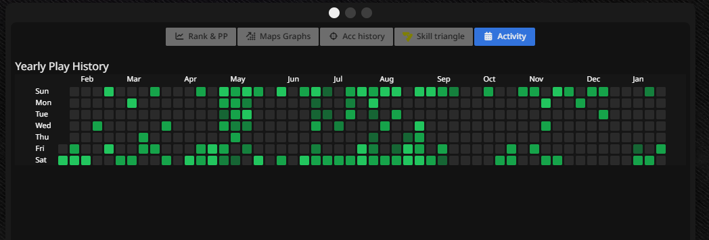

# BeatLeader Activity Graph

BeatLeaderのプロフィールページに、GitHubのようなアクティビティグラフを追加するブラウザ拡張機能です。



## 機能

- 過去1年間のプレイ履歴を日別で可視化
- 緑色の濃さでプレイ回数を表示（濃いほど多い）
- 各マスにホバーすると日付とプレイ回数を確認可能
- BeatLeaderのUIに自然に統合

## インストール方法

### 1. ビルド

```bash
# リポジトリをクローン
git clone https://github.com/suzuran-chan/beatleader-activity-graph.git
cd beatleader-activity-graph

# 依存関係をインストール
npm install

# ビルド
npm run build
```

### 2. Chromeにインストール

1. Chromeで `chrome://extensions` を開く
2. 右上の「デベロッパーモード」をONにする
3. 「パッケージ化されていない拡張機能を読み込む」をクリック
4. ビルドで生成された `dist` フォルダを選択

### 3. Edgeにインストール

1. Edgeで `edge://extensions` を開く
2. 左下の「開発者モード」をONにする
3. 「展開して読み込み」をクリック
4. ビルドで生成された `dist` フォルダを選択

## 使い方

1. [BeatLeader](https://www.beatleader.xyz) にアクセス
2. 任意のプレイヤーのプロフィールページを開く（例: `https://www.beatleader.xyz/u/xxxx`）
3. チャートセクションに「**Activity**」ボタンが追加されています
4. 「Activity」ボタンをクリックすると年間プレイ履歴グラフが表示されます

## 開発

```bash
# 開発サーバーを起動（ホットリロード対応）
npm run dev

# リント
npm run lint

# プレビュー
npm run preview
```

## 技術スタック

- React 18
- TypeScript
- Vite
- Tailwind CSS
- CRXJS Vite Plugin

## ライセンス

MIT
